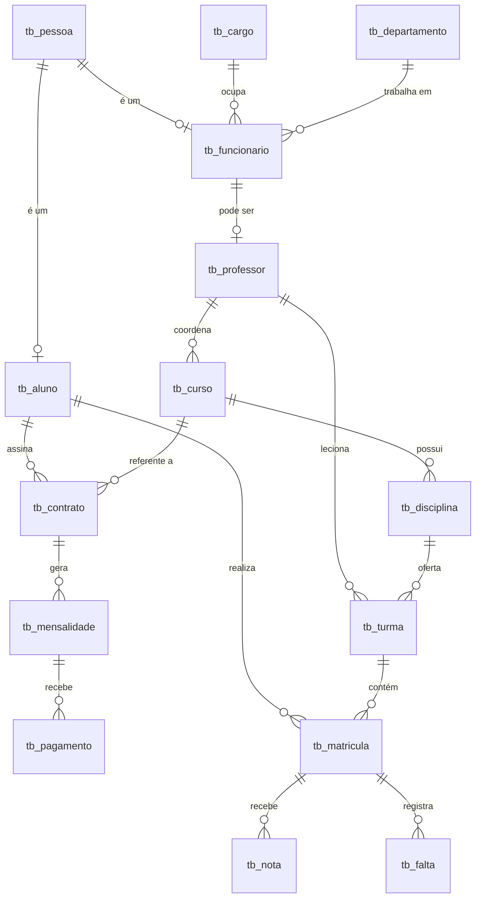

 📋 Histórico de Desenvolvimento — ERP Educacional
 
> Repositório: [sistema-academico-sql](https://github.com/caioemanoelxavier-bit/sistema-academico-sql)
 
---
 
## 🗂️ Visão Geral do Projeto
 
Sistema ERP Educacional integrado em três módulos (**Acadêmico**, **Financeiro** e **RH**), desenvolvido em SQL com foco em integridade referencial, regras de negócio e base analítica para Business Intelligence.
 
---
 
## 📅 Histórico de Iterações
 
---
 
### ✅ Iteração 1 — Definição da Arquitetura e Dicionário de Dados
 
**Objetivo:** Estruturar os três módulos do sistema e documentar todas as tabelas.
 
**Entregas:**
- Definição da arquitetura de módulos (Acadêmico · Financeiro · RH)
- Dicionário de dados completo das **16 tabelas**
- Tabela de relacionamentos entre módulos (14 relacionamentos mapeados)
 
**Tabelas definidas por módulo:**
 
| Módulo | Tabelas |
|--------|---------|
| 📚 Acadêmico | `tb_pessoa`, `tb_aluno`, `tb_curso`, `tb_disciplina`, `tb_turma`, `tb_matricula`, `tb_nota`, `tb_falta` |
| 💰 Financeiro | `tb_contrato`, `tb_mensalidade`, `tb_pagamento` |
| 👥 RH | `tb_departamento`, `tb_cargo`, `tb_funcionario`, `tb_professor` |
 
---
 
### ✅ Iteração 2 — Identificação das Tabelas Ausentes e Script DDL
 
**Objetivo:** Identificar lacunas no esquema original e criar os scripts DDL das tabelas faltantes.
 
**Problema identificado:** Três tabelas estavam ausentes no esquema original:
- `tb_pessoa` — Base unificada para alunos e funcionários
- `tb_turma` — Vínculo entre o módulo Acadêmico e o RH
- `tb_matricula` — Intersecção do aluno com a turma
 
**Scripts DDL criados:**
 
```sql
-- Tabela Pessoa
CREATE TABLE tb_pessoa (
    pk_cpf        CHAR(11)      PRIMARY KEY,
    rg            VARCHAR(20)   UNIQUE NOT NULL,
    dt_nascimento DATE          NOT NULL,
    genero        ENUM('M', 'F', 'Outro', 'N/I') NOT NULL,
    criado_em     TIMESTAMP     DEFAULT CURRENT_TIMESTAMP,
    atualizado_em TIMESTAMP     DEFAULT CURRENT_TIMESTAMP
                                ON UPDATE CURRENT_TIMESTAMP
);
 
-- Tabela Turma
CREATE TABLE tb_turma (
    pk_turma      INT           AUTO_INCREMENT PRIMARY KEY,
    fk_disciplina INT           NOT NULL,
    fk_professor  INT           NOT NULL,
    codigo_turma  VARCHAR(50)   UNIQUE NOT NULL,
    vagas         INT           NOT NULL,
    semestre_ano  VARCHAR(6)    NOT NULL,
    criado_em     TIMESTAMP     DEFAULT CURRENT_TIMESTAMP,
    atualizado_em TIMESTAMP     DEFAULT CURRENT_TIMESTAMP
                                ON UPDATE CURRENT_TIMESTAMP,
    CONSTRAINT chk_turma_vagas     CHECK (vagas > 0),
    CONSTRAINT fk_turma_disciplina FOREIGN KEY (fk_disciplina)
        REFERENCES tb_disciplina(pk_disciplina),
    CONSTRAINT fk_turma_professor  FOREIGN KEY (fk_professor)
        REFERENCES tb_professor(pk_professor)
);
 
-- Tabela Matrícula
CREATE TABLE tb_matricula (
    pk_matricula  INT           AUTO_INCREMENT PRIMARY KEY,
    fk_rgm        INT           NOT NULL,
    fk_turma      INT           NOT NULL,
    status        ENUM('ativa', 'reprovada', 'aprovada', 'cancelada')
                                NOT NULL DEFAULT 'ativa',
    media_final   DECIMAL(4,2)  NULL,
    dt_matricula  TIMESTAMP     DEFAULT CURRENT_TIMESTAMP,
    atualizado_em TIMESTAMP     DEFAULT CURRENT_TIMESTAMP
                                ON UPDATE CURRENT_TIMESTAMP,
    CONSTRAINT chk_matricula_media       CHECK (media_final >= 0.00 AND media_final <= 10.00),
    CONSTRAINT fk_matricula_aluno        FOREIGN KEY (fk_rgm)
        REFERENCES tb_aluno(pk_rgm),
    CONSTRAINT fk_matricula_turma        FOREIGN KEY (fk_turma)
        REFERENCES tb_turma(pk_turma),
    CONSTRAINT unq_matricula_aluno_turma UNIQUE (fk_rgm, fk_turma)
);
```
 
**Constraints implementadas:**
- `CHECK` para validar `vagas > 0` e `media_final` entre 0 e 10
- `UNIQUE` composto em `(fk_rgm, fk_turma)` para evitar matrícula duplicada
- `FOREIGN KEY` com `REFERENCES` para todas as dependências
 
---
 
### ✅ Iteração 3 — Regras de Negócio (RN-01 a RN-05)
 
**Objetivo:** Documentar e validar as regras de negócio críticas do sistema.
 
| Código | Regra | Módulos Envolvidos |
|--------|-------|--------------------|
| RN-01 | Matrícula vinculada ao contrato ativo | Acadêmico × Financeiro |
| RN-02 | Nota só pode ser lançada em matrícula ativa | Acadêmico |
| RN-03 | Geração automática de mensalidades ao ativar contrato | Financeiro |
| RN-04 | Limite de vagas por turma | Acadêmico |
| RN-05 | Funcionário deve existir antes de virar professor | RH |
 
**Detalhamento:**
 
#### RN-01 — Matrícula vinculada ao contrato ativo
```sql
SELECT pk_contrato FROM tb_contrato
WHERE fk_rgm = :rgm AND fk_curso = :curso AND status = 'ativo';
```
> Validação antes de todo INSERT em `tb_matricula`.
 
#### RN-02 — Nota só pode ser lançada em matrícula ativa
```sql
-- Trigger BEFORE INSERT em tb_nota
IF (SELECT status FROM tb_matricula WHERE pk_matricula = NEW.fk_matricula) != 'ativa' THEN
    SIGNAL SQLSTATE '45000' SET MESSAGE_TEXT = 'Matrícula não está ativa.';
END IF;
```
 
#### RN-03 — Geração automática de mensalidades
```
vlr_liquido = vlr_bruto × (1 - desconto_pct / 100)
```
> Trigger AFTER INSERT em `tb_contrato` quando `status = 'ativo'`.
 
#### RN-04 — Limite de vagas por turma
```sql
SELECT COUNT(*) FROM tb_matricula
WHERE fk_turma = :turma AND status = 'ativa';
-- resultado deve ser < tb_turma.vagas
```
 
#### RN-05 — Funcionário deve existir antes de virar professor
```sql
-- Trigger BEFORE INSERT em tb_professor
IF (SELECT status FROM tb_funcionario WHERE pk_funcionario = NEW.fk_funcionario) != 'ativo' THEN
    SIGNAL SQLSTATE '45000' SET MESSAGE_TEXT = 'Funcionário não está ativo.';
END IF;
```
 
---
 
### ✅ Iteração 4 — Diagrama ER (Notação Mermaid)
 
**Objetivo:** Mapear visualmente todas as entidades e relacionamentos.
 

 
---
 
### ✅ Iteração 5 — Visão de BI / IA
 
**Objetivo:** Mapear os campos de maior valor analítico para dashboards e modelos preditivos.
 
| Campo | Tabela | Aplicação | Insight |
|-------|--------|-----------|---------|
| `dt_pagamento` | `tb_pagamento` | Fluxo de Caixa | Projeções de receita e inadimplência |
| `valor` (nota) | `tb_nota` | Desempenho Acadêmico | Alunos em risco de reprovação |
| `status` (matrícula) | `tb_matricula` | Taxa de Evasão | Curva de evasão por semestre |
| `dt_inscricao` | `tb_aluno` | Sazonalidade | Meses de maior ingresso |
| `justificada` (falta) | `tb_falta` | Frequência & Saúde | Risco de evasão por faltas |
| `salario` | `tb_funcionario` | Folha de Pagamento | Custos por departamento |
 
---
 
### ✅ Iteração 6 — Padronização (Regra de Ouro)
 
**Objetivo:** Definir convenções de nomenclatura para todo o esquema.
 
| Elemento | Padrão | Exemplo |
|----------|--------|---------|
| Tabelas | `tb_` + snake_case minúsculo | `tb_aluno`, `tb_pagamento` |
| Chave Primária | `pk_` + nome descritivo | `pk_rgm`, `pk_contrato` |
| Chave Estrangeira | `fk_` + tabela referenciada | `fk_curso`, `fk_matricula` |
| Constraint CHECK | `chk_` + campo | `chk_cpf`, `chk_nota_valor` |
| Constraint FK | `fk_` + tabela_origem_campo | `fk_aluno_pessoa` |
| Tipos monetários | `DECIMAL(10,2)` | `vlr_mensalidade`, `salario` |
| Datas | `DATE` ou `TIMESTAMP` | `dt_matricula`, `criado_em` |
| Flags booleanas | `TINYINT(1)` — 0 ou 1 | `justificada` |
| Listas fechadas | `ENUM(...)` | `status`, `regime`, `titulacao` |
| Auditoria | `criado_em` + `atualizado_em` | Em todas as tabelas |
 
---
 
### ✅ Iteração 7 — Geração da Documentação em PDF
 
**Objetivo:** Gerar documentação técnica formatada para entrega acadêmica.
 
**Ferramenta utilizada:** Python + ReportLab
 
**Conteúdo do PDF gerado (`ERP_Educacional_Documentacao.pdf`):**
- Sumário navegável
- Seção 1 — Visão Geral e Arquitetura
- Seção 2 — Dicionário de Dados (16 tabelas, 3 módulos)
- Seção 3 — Scripts DDL das tabelas ausentes
- Seção 4 — Diagrama ER em Mermaid
- Seção 5 — Regras de Negócio (RN-01 a RN-05)
- Seção 6 — Visão de BI / IA
- Seção 7 — Padronização
- Seção 8 — Documento de Requisitos + link do repositório
 
**Ajustes aplicados após revisão:**
- Remoção da capa (v1 → v2)
- Adição do link do repositório GitHub no final do documento (v2 → v3)
 
---
 
## 🗃️ Estrutura de Arquivos Sugerida para o Repositório
 
```
sistema-academico-sql/
│
├── README.md                        # Visão geral do projeto
├── DEVELOPMENT.md                   # Este arquivo — histórico de desenvolvimento
│
├── sql/
│   ├── 01_tb_pessoa.sql             # DDL — tb_pessoa
│   ├── 02_tb_aluno.sql              # DDL — tb_aluno
│   ├── 03_tb_curso.sql              # DDL — tb_curso
│   ├── 04_tb_disciplina.sql         # DDL — tb_disciplina
│   ├── 05_tb_turma.sql              # DDL — tb_turma
│   ├── 06_tb_matricula.sql          # DDL — tb_matricula
│   ├── 07_tb_nota.sql               # DDL — tb_nota
│   ├── 08_tb_falta.sql              # DDL — tb_falta
│   ├── 09_tb_contrato.sql           # DDL — tb_contrato
│   ├── 10_tb_mensalidade.sql        # DDL — tb_mensalidade
│   ├── 11_tb_pagamento.sql          # DDL — tb_pagamento
│   ├── 12_tb_departamento.sql       # DDL — tb_departamento
│   ├── 13_tb_cargo.sql              # DDL — tb_cargo
│   ├── 14_tb_funcionario.sql        # DDL — tb_funcionario
│   ├── 15_tb_professor.sql          # DDL — tb_professor
│   └── triggers/
│       ├── trg_rn01_matricula.sql   # Trigger — RN-01
│       ├── trg_rn02_nota.sql        # Trigger — RN-02
│       ├── trg_rn03_mensalidade.sql # Trigger — RN-03
│       ├── trg_rn04_vagas.sql       # Trigger — RN-04
│       └── trg_rn05_professor.sql   # Trigger — RN-05
│
├── docs/
│   └── ERP_Educacional_Documentacao.pdf
│
└── diagrams/
    └── er_diagram.mmd               # Diagrama ER em Mermaid
```
 
---